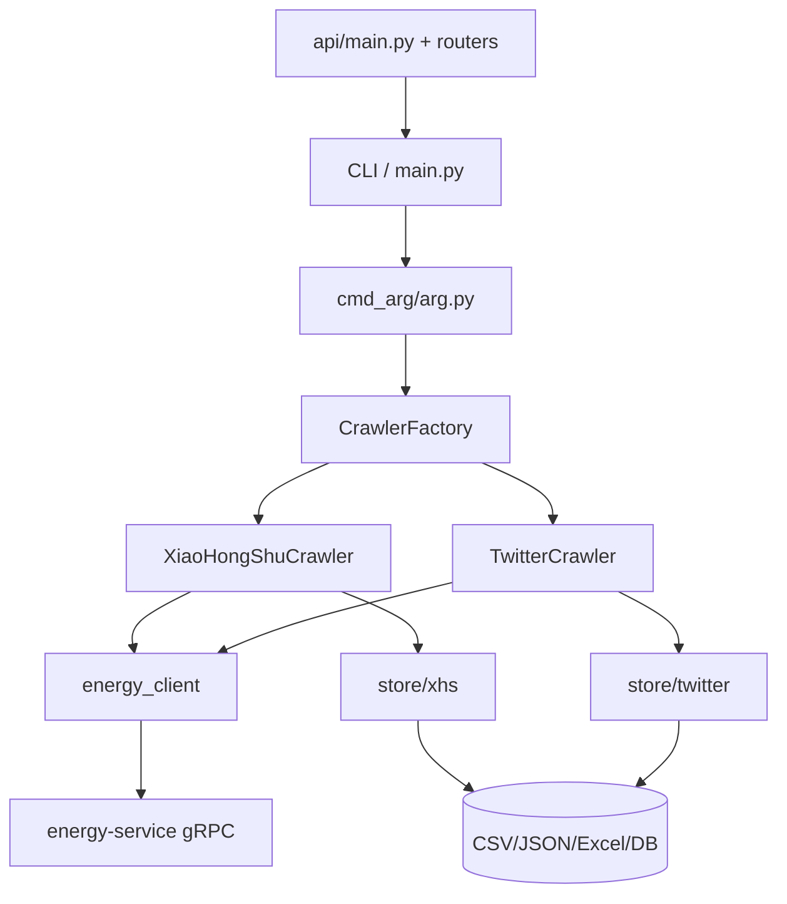

# 项目架构文档（xhs + x）

## 1. 范围

当前主干只支持：

- `xhs`（小红书）
- `x`（X / Twitter）

非目标平台代码已从主链路移除，文档也以当前实现为准。

## 2. 总体架构

## 3. 启动流程

1. `main.py` 调用 `cmd_arg.parse_cmd()` 解析参数并覆盖 `config`。
2. 通过 `CrawlerFactory` 按 `--platform` 创建爬虫实例。
3. 爬虫执行抓取，必要时通过 Energy 服务完成浏览器交互/签名。
4. 数据写入 `store`（csv/json/excel/sqlite/mysql/postgres/mongodb）。
5. 退出时执行统一清理逻辑（浏览器、连接、文件 flush）。

## 4. 模块职责

### 4.1 CLI 层

- `main.py`：程序入口、生命周期与清理管理
- `cmd_arg/arg.py`：参数定义与配置覆盖

### 4.2 平台层

- `media_platform/xhs/`：xhs 抓取主逻辑、登录与签名适配
- `media_platform/twitter/`：x 抓取、认证与 DOM/API 解析

### 4.3 浏览器与签名层

- `energy-service/`：Go 实现的浏览器 gRPC 服务
- `energy_client/`：Python 客户端与适配器

### 4.4 存储层

- `store/xhs/`：xhs 的 CSV/JSON/DB/Mongo/Excel 实现
- `store/twitter/`：x 的 CSV/JSON/DB/Mongo/Excel 实现
- `store/excel_store_base.py`：平台无关的 Excel 输出封装

### 4.5 数据层

- `database/models.py`：仅保留 xhs + twitter 对应 ORM 表
- `database/db_session.py`：异步会话、建库建表与连接管理

### 4.6 API 层

- `api/routers/crawler.py`：启动/停止/状态/日志
- `api/routers/data.py`：文件浏览、下载与统计
- `api/services/crawler_manager.py`：子进程管理

## 5. 关键配置

配置集中在 `config/base_config.py`：

- 平台：`PLATFORM = "xhs" | "x"`
- Energy：
  - `ENABLE_ENERGY_BROWSER`
  - `ENERGY_SERVICE_ADDRESS`
  - `XHS_ENABLE_ENERGY`
  - `TWITTER_ENABLE_ENERGY`
- 抓取模式：`CRAWLER_TYPE = search | detail | creator`
- 存储：`SAVE_DATA_OPTION`

## 6. 数据输出策略

支持输出：

- 文件：`csv`、`json`、`excel`
- 数据库：`sqlite`、`db(mysql)`、`postgres`、`mongodb`

建议：

- 调试期使用 `json` 或 `excel`
- 长期运行使用 `sqlite` 或关系型数据库

## 7. 扩展建议

若要新增平台，建议遵循现有模式：

1. 在 `media_platform/<platform>/` 增加 crawler 与 client。
2. 在 `store/<platform>/` 增加存储工厂与实现。
3. 在 `main.py` 的 `CrawlerFactory` 注册平台。
4. 在 `cmd_arg` 和 `api/schemas` 增加平台枚举。
5. 补齐 `tests/`。

## 8. 已知限制

- 文档默认以本地运行为前提，不包含生产化部署编排。
- Energy 服务需先启动，否则平台侧签名与浏览器操作会失败。

